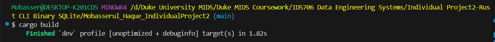
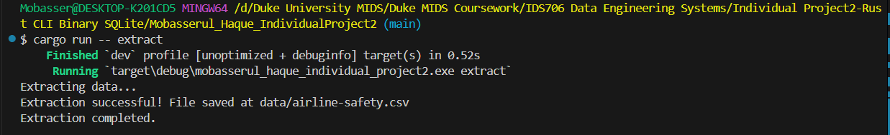
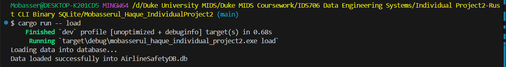
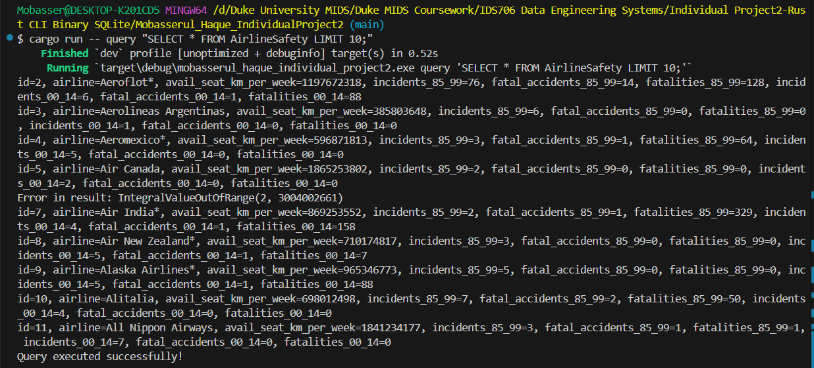
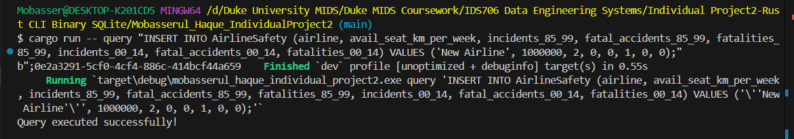
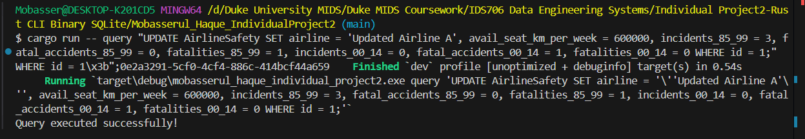
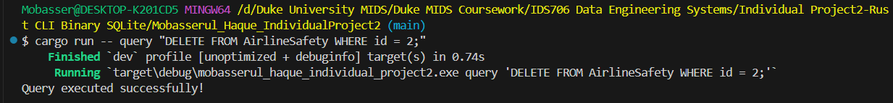

[](https://github.com/nogibjj/Mobasserul_Haque_IndividualProject2/actions/workflows/rust_cicd.yml)

# Individual Project #2: Rust CLI Binary with SQLite - Airline Safety Database ETL and Query Tool

This project is a Rust-based CLI application that provides an ETL (Extract, Transform, Load) and querying tool for managing and analyzing the Airline Safety Database. It supports various operations such as extracting airline safety data, loading it into an SQLite database, and performing CRUD (Create, Read, Update, Delete) operations using SQL queries.

## Features

- **Extract**: Download airline safety data from a public source and save it locally as a CSV file.
- **Transform and Load**: Process and load the CSV data into an SQLite database (`AirlineSafetyDB.db`).
- **Query**: Perform SQL queries on the data for analysis and manipulation.
- **CRUD Operations**:
  - Insert new records into the database.
  - Update existing records.
  - Read and fetch data from the database.
  - Delete specific records from the database.


## Directory Structure

```
.
├── .devcontainer
│   ├── devcontainer.json       
│   ├── Dockerfile              
├── .github
│   └── workflows
│       └── rust_cicd.yml       
├── data
│   └── airline-safety.csv      
├── src
│   ├── lib.rs                  
│   └── main.rs                 
├── target                      
├── tests
│   └── tests.rs                
├── .coverage                   
├── .gitignore                  
├── AirlineSafetyDB.db          
├── Cargo.lock                  
├── Cargo.toml                  
├── Makefile                    
├── query_output.md             
├── rust_query_log.md           
├── README.md                   
├── Rust_Build.PNG              
├── Rust_Delete.PNG             
├── Rust_Insert.PNG             
├── Rust_Load.PNG               
├── Rust_Read.PNG               
├── Rust_Update.PNG             

```
## Arguments

The application supports the following arguments for interacting with the database:
- `record_id`: The unique identifier for a record.
- `airline`: The name of the airline.
- `avail_seat_km_per_week`: Available seat kilometers per week for the airline.
- `incidents_85_99`: Number of incidents from 1985 to 1999.
- `fatal_accidents_85_99`: Number of fatal accidents from 1985 to 1999.
- `fatalities_85_99`: Number of fatalities from 1985 to 1999.
- `incidents_00_14`: Number of incidents from 2000 to 2014.
- `fatal_accidents_00_14`: Number of fatal accidents from 2000 to 2014.
- `fatalities_00_14`: Number of fatalities from 2000 to 2014.

## Installation

### Prerequisites
- **Rust programming language** and **Cargo package manager**.
- **SQLite** installed on your system.

## Build the Project

To build the project, run:

```bash
cargo build
```


## Usage

### Available Commands

#### Extract Data
```bash
cargo run -- extract
```
This will download the `airline-safety.csv` file to the `data` directory.


#### Load Data
```bash
cargo run -- load
```
This will load the `airline-safety.csv` data into the SQLite database (`AirlineSafetyDB.db`).


### Run Queries: 

Use the `query` command to perform SQL operations on the database.

- **Read Data:**
  ```bash
  cargo run -- query "SELECT * FROM AirlineSafety LIMIT 10;"
  ```


- **Insert Data:**
  ```bash
  cargo run -- query "INSERT INTO AirlineSafety (airline, avail_seat_km_per_week, incidents_85_99, fatal_accidents_85_99, fatalities_85_99, incidents_00_14, fatal_accidents_00_14, fatalities_00_14) VALUES ('New Airline', 1000000, 2, 0, 0, 1, 0, 0);"
  ```


- **Update Data:**
  ```bash
  cargo run -- query "UPDATE AirlineSafety SET airline = 'Updated Airline A', avail_seat_km_per_week = 600000, incidents_85_99 = 3, fatal_accidents_85_99 = 0, fatalities_85_99 = 1, incidents_00_14 = 0, fatal_accidents_00_14 = 1, fatalities_00_14 = 0 WHERE id = 1;"
  ```


- **Delete Data:**
  ```bash
  cargo run -- query "DELETE FROM AirlineSafety WHERE id = 2;"
  ```


#### Run Tests
```bash
cargo test
```
#### Build Optimized Binary
```bash
cargo build --release
```
## Use of GitHub Copilot and Other LLMs

GitHub Copilot was utilized extensively during the development of this project to:
- Suggest boilerplate code for repetitive tasks, such as SQL query templates and Rust function signatures.
- Provide intelligent code suggestions for Rust-specific features, including error handling with `Result` and using crates like `rusqlite` and `reqwest`.
- Generate utility functions, such as logging SQL queries to a Markdown file, and handling edge cases in CSV processing.

LLM models were used to:
- Debug errors during the development process, such as SQL syntax issues and Rust-specific compiler errors.
- Optimize and refactor Rust code to improve readability and performance.
- Generate the initial structure for files like the `Makefile` and `GitHub Actions` workflows.
- Provide guidance on integrating unit tests (`tests.rs`) with Rust's testing framework.
- Clarify complex concepts related to Rust features, such as ownership, lifetimes, and trait implementations.

By leveraging these tools, the development process became more efficient, allowing for faster iteration and better error resolution.

## CI/CD Workflow

This project includes a GitHub Actions pipeline defined in `rust_cicd.yml`. The workflow:

- Checks out the repository.
- Installs and updates the Rust toolchain.
- Formats, lints, tests, and runs the project.
- Builds an optimized binary in release mode.
- Uploads the optimized binary as an artifact.

You can trigger the workflow by pushing changes or creating a pull request to the `main` branch.

### Makefile: 

The `Makefile` simplifies common operations:

- **Format Code:**
  ```bash
  make format
  ```

- **Lint Code:**
  ```bash
  make lint
  ```

- **Run Tests:**
  ```bash
  make test
  ```

- **Build and Run:**
  ```bash
  make all
  ```

### Makefile: 

The `Makefile` simplifies common operations:

- **Format Code:**
  ```bash
  make format
  ```

- **Lint Code:**
  ```bash
  make lint
  ```

- **Run Tests:**
  ```bash
  make test
  ```

- **Build and Run:**
  ```bash
  make all
  ```

### Optimized Rust Binary

The binary file for this project can be accessed here: https://github.com/nogibjj/Mobasserul_Haque_IndividualProject2/actions/runs/12252756097/artifacts/2298606566
  


